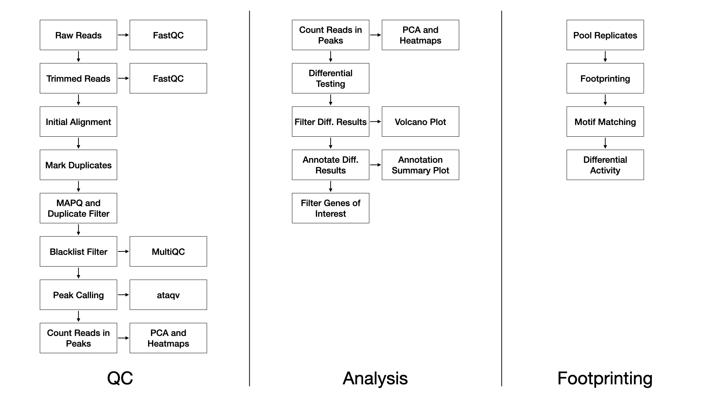

## Methods

### QC

We use FastQC [@noauthor_fastqc_nodate] (v0.11.8) to assess the overall quality of each sequenced sample.

We use TrimGalore [@noauthor_trimgalore_nodate] (v0.4.5) and cutadapt [@martin_cutadapt_nodate] (v1.15) with the following parameters: `--nextera -e 0.1 --stringency 6 --length 20 --nextseq 20`.

We align trimmed reads to the reference genome with Bowtie2 [@langmead_fast_2012] (v2.3.4.1) with the following parameters: `-X 2000 --no-mixed --no-discordant`, and defaults multi-seed length of 20bp with 0 mismatches.

Duplicate reads are marked with Picard [@noauthor_picard_nodate] (v2.20.2).

Alignments to autosomes and sex chromosomes are kept (i.e. mitochondrial reads are removed), duplicates marked by Picard are removed, and alignments below a MAPQ threshold are removed. These filtering steps are performed with samtools [@li_sequence_2009] (v1.2) and the parameters: `-q 10 -F 1024`.

Reads completely overlapping blacklisted regions [@noauthor_encode_nodate] are removed with bedtools [@quinlan_bedtools_2010] (v2.28.0).

Sample-wise peaks are called with macs2 [@zhang_model-based_2008] (v2.1.2) with flags: `-f BAM --nomodel --shift -100 --extsize 200`.

Peaks over all samples are merged with bedops [@neph_bedops_2012] (v2.4.36) for the purpose of principal component analysis and unsupervised clustering to assess the similarity of samples.

Finally, MultiQC [@ewels_multiqc_2016] (v1.7) generates a report combining FastQC, trimming, alignment, and duplicate calling over all the samples. For ATAC specific QC metrics we use ataqv [@noauthor_ataqv_nodate] (v1.0.0).

### Differential Testing

We use the edgeR R Bioconductor package [@mccarthy_differential_2012] to identify regions of differentially open chromatin (DOC). For each sample, the number of reads in the merged peaks is counted for each sample, and a library size normalization factor is determined. With no replicates, we manually tune the BCV (biological coefficient of variance) parameter. We then fit each model using the glmFit function, and test each contrast with a likelihood ratio test. With replicates, the common, trended, and tagwise negative binomial dispersions are calculated. We then fit each model using the glmQLFit function, and test each contrast with an empirical Bayes quasi-likelihood F-test. The DOC are then annotated to genic and CpG island annotations using the annotatr R Bioconductor package [@cavalcante_annotatr_2017].

### Footprinting

We use the HINT tool in the Regulatory Genomics Toolbox (rgt-hint) to do footprinting and motif binding analysis [@li_hint_2019]. Briefly, for each condition, the reads among the replicates are pooled and tag counts are determined within the merged peaks. Next motifs from the JASPAR database [@jaspar] are queried against the footprints found within each condition. Finally, a differential score representing the transcription factor binding activity and the openness of the surrounding chromatin is calculated and visualized between pairs of conditions.

## References