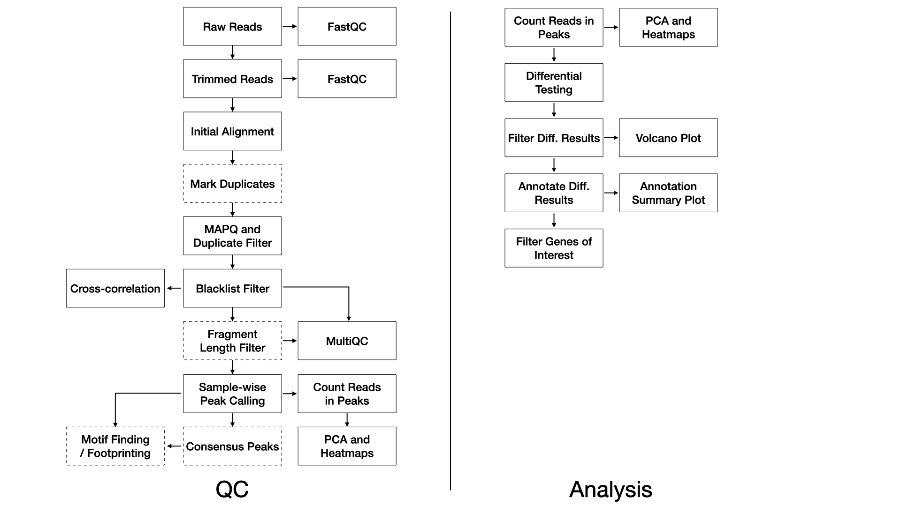

### Methods

We use FastQC [@noauthor_fastqc_nodate] (v0.11.8) to assess the overall quality of each sequenced sample. 

We use TrimGalore [@noauthor_trimgalore_nodate] (v0.4.5) and cutadapt [@martin_cutadapt_nodate] (v1.15) with the following parameters: `--nextera -e 0.1 --stringency 6 --length 20 --nextseq 20`. 

We align trimmed reads to the reference genome with Bowtie2 [@langmead_fast_2012] (v2.3.4.1) using default parameters with the exception of the following flags: `-X 2000`. 

Duplicate reads may be are marked with Picard [@noauthor_picard_nodate] (v2.20.2). 

Alignments are filtered with samtools [@li_sequence_2009] (v1.2) using the flags: `-q 10 -F 1024`. 

Alignments completely overlapping blacklisted regions [@noauthor_encode_nodate] are removed with bedtools [@quinlan_bedtools_2010] (v2.28.0). 

Sample-wise peaks are called with macs2 [@zhang_model-based_2008] (v2.1.2) with flags: `--format BAMPE --gsize mm --qvalue 0.05`.

Optionally, consensus peaks for replicates are determined by mutual intersection of sample-wise peaks with bedops --intersect. Consensus peaks are then annotated with annotatr [@cavalcante_annotatr_2017].

Optionally, motifs for consensus peaks are found with HOMER [@heinz_simple_2010] (v4.11.1).

Peaks over all samples are merged with bedops [@neph_bedops_2012] (v2.4.36) for the purpose of principal component analysis and unsupervised clustering to assess the similarity of samples. Read cross-correlations within samples are plotted using phantompeakqualtools [@landt_chip-seq_2012]. MultiQC [@ewels_multiqc_2016] (v1.7) generates a report combining FastQC, trimming, alignment, and duplicate calling over all the samples. The software DeepTools is used to calculate coverage and IP efficiency plots [@ramirez_deeptools2_2016] (v3.3.0).

### References