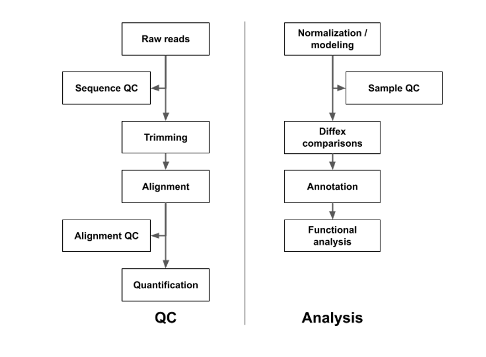

## Methods

Adapters will be trimmed with CutAdapt [@martin_cutadapt_nodate] to remove adapters and low-quality bases and overall quality will assessed with FastQC [@noauthor_fastqc_nodate], FastQCScreen [@Wingett_Andrews_2018], and MultiQC [@ewels_multiqc_2016]. Reads will be aligned and quantified using RSEM/STAR [@Li_RSEM_2011],[@Dobin_STAR_2013]. Differential expression modeling  will use the DESeq2 [@Love_DESeq2_2014]. Intra and inter group variance will be assessed with Principal Component Analysis. Candidate DEGs are visualized with volcano plots filtered to the subset of DEGs where Benjamini-Hochberg adjusted p-value ≤ 0.05 [@Benjamini_FDR_1995]. Functional analysis using Advaita iPathwayGuide [@Draghici_iPathwayGuide_2007],[@noauthor_ipathwayguide] will assess enrichment of KEGG pathways and Gene Ontology (GO) concepts.

## References