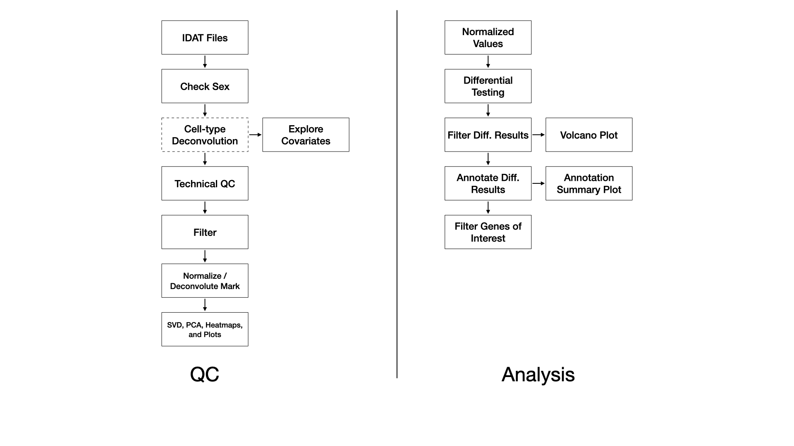

### Methods

Samples are processed with the SeSAMe R Bioconductor package [@10.1093/nar/gky691]. Briefly, red/green IDAT files are read and processed according to the [preparation code](https://zhou-lab.github.io/sesame/v1.18/sesame.html#Preprocessing_Function_Code). Experiment-independent masking occurs with the quality mask code ("Q"), and accounts for probes containing SNPs, with known cross-hybridization issues [@Pidsley2013], and with other issues. Experiment-dependent is done according to the p-value with out-of-bound array hybridization (pOOBAH) algorithm ("P"), which is an improvement on detection p-value filtering [@10.1093/nar/gky691]. Non-linear dye bias correction ("D") is performed followed by background correction with the NOOB method ("B") [@Fortin2014]. This processing pipeline constitutes a within-array normalization procedure. We note that recent studies have indicated within-array normalization with dye-bias correction and NOOB performs as well or better than between-array normalization procedures [@10.1186/s13148-023-01459-z].

A probe has with pOOBAH masking (p-value < 0.05) in more than 5% of samples it is removed. Similarly, if a sample has more than 10% of probes pOOBAH masked, then that sample is removed.

Cell type deconvolution of whole blood or cord blood may be performed with the FlowSorted.Blood.EPIC or FlowSorted.CordBlood.450k R Bioconductor package, respectively, using a modified version of the Houseman method [@houseman_dna_2012].

In the event of a BS/oxBS or BS/TAB library preparation, methylation mark deconvolution may be performed using the MLML2R R package [@10.1093/bioinformatics/btt459]. Briefly, methylated and unmethylated channel matrices from bisulfite-only treated samples and oxidative-bisulfte treated samples are extracted and passed to MLML2R::MLML() to determine the levels of methylcytosine (mC), hydroxymethylcytosine (hmC), and cytosine (C) using the exact method provided in the package.

### References