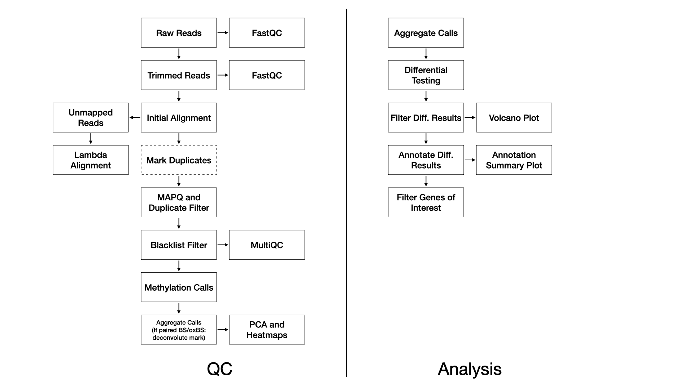

## Methods

### QC

We use FastQC [@noauthor_fastqc_nodate] (v0.11.8) to assess the overall quality of each sequenced sample.

We use TrimGalore [@@article{noauthor_trimgalore_nodate,
] (v0.4.5) with the following parameters: `--adapter AGATCGGAAGAGC -e 0.1 --stringency 6 --length 20 --nextseq 20`, and with the additional `--rrbs` flag in the ERRBS case.

Reads are aligned to the reference genome with Bismark [@Krueger:2011eb] (v0.22.1) using Bowtie2 [@langmead_fast_2012] (v2.3.4) with default settings (multi-seed length of 20bp with 0 mismatches).

For WGBS, duplicate reads are marked and removed with Picard [@noauthor_picard_nodate] (v2.20.2). This step is not performed for ERRBS.

Alignments below a MAPQ threshold are removed with samtools [@li_sequence_2009] (v1.2) and the parameters: `-q 10`.

MethylDackel [@noauthor_methyldackel] (v0.4.0) then calls methylation rates with parameters `-d 5 -D 2000 --mergeContext`.

In the event of a BS/oxBS or BS/TAB library preparation, methylation mark deconvolution is then performed using the MLML2R R package [@10.1093/bioinformatics/btt459]. Briefly, methylated and unmethylated counts from bisulfite-only treated samples and oxidative-bisulfte treated samples are extracted and passed to MLML2R::MLML() to determine the levels of methylcytosine (mC), hydroxymethylcytosine (hmC), and cytosine (C) using the exact method provided in the package.

### Differential Testing

#### Without Mark Deconvolution

Differential methylation testing is performed with the MethylSig R Bioconductor package which performs group-versus-group tests using a beta-binomial approach to calculate differential methylation statistics, accounting for variation among replicates within each group [@Park:2014ho]. Alternately, differential methylation testing can be performed with the DSS R bioconductor package which is a beta-binomial approach with arcsine link function to test under general experimental design [@Wu:2016hq].

#### With Mark Deconvolution

We use the gamlss R package to identify differentially methylated probes (DMPs) by fitting a beta-regression model on the beta-values [@stasinopoulos_generalized_2007]. The DMPs are then annotated to CpG island and genic annotations using the annotatr R Bioconductor package [@cavalcante_annotatr_2017].

## References