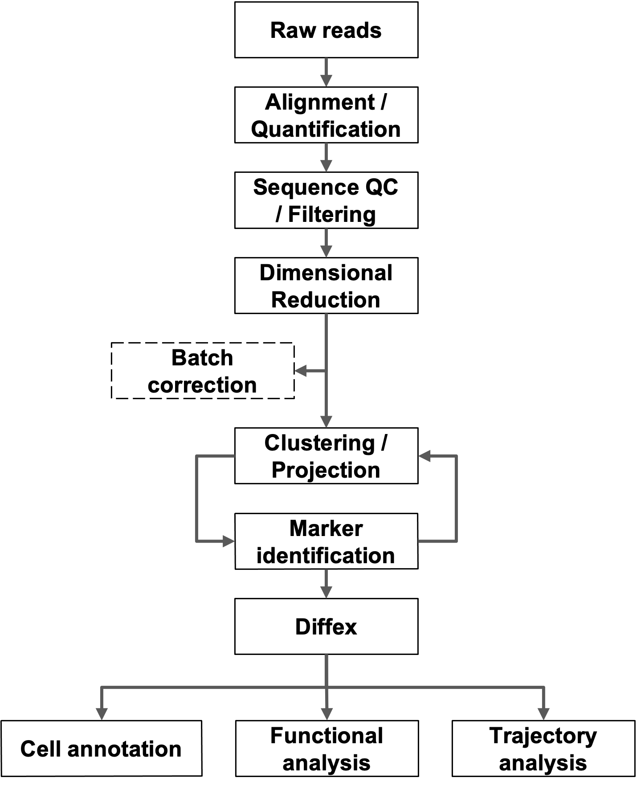

<style type="text/css">
body, td {
   font-size: 18px;
}
code.r{
  font-size: 12px;
}
pre {
  font-size: 12px
}
</style>



```{asis, echo = !all_methods}
## Methods
```

Raw sequence data is transformed to gene-barcode count matrices using CellRanger [@Zheng_CellRanger_2017]. Further data analysis is primarily performed using the Seurat package [@Stuart_Seurat_2019]. Gene-barcode matrices and metadata for each sample are loaded and further filtering and clustering analyses were performed as described in the Seurat tutorials [@Seurat_tutorials]. Aberrant cells are filtered (low complexity, duplets, or apoptotic cells) and based on detected debris/contamination DecontX [@Yang_DecontX_2020] may be run. Counts are normalized using the default normalization approach and variable features were identified. Where appropriate, anchor points were then generated across related datasets and used for SCTransform data integration. Principal component analysis (PCA) is then performed to identify significant PCA components used to find nearest neighbors followed by graph-based, semi- unsupervised clustering into distinct populations. Projections are generated using uniform manifold approximation [@Becht_UMAP_2018] and marker genes are identified through differential gene expression pairwise comparisons (Wilcoxon rank-sum test for single-cell gene expression; FindAllMarkers function). Cell-type predictions were also generated with scCATCH [@Shao_scCATCH_2020]. Suitability and approach for trajectory analysis is determined based on experimental design and disease model [@Saelens_2019; @Lange_CellRank_2022; @Cao_Monocle3_2019; @Wolf_PAGA_2019; @La_Manno_RNAVelocity_2018; @Bergen_RNAVelocity_2020]. 

```{asis, echo = !all_methods}
## References
```